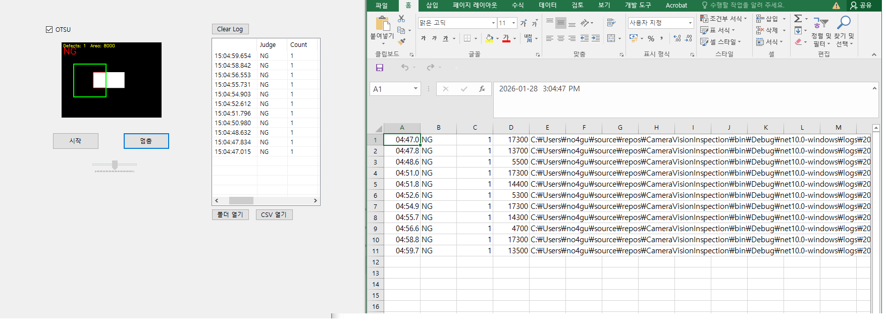

# CameraVisionInspection

실시간 영상 기반 결함 검출을 수행하는 머신비전 검사 시스템입니다.  
C# WinForms와 OpenCvSharp(OpenCV)을 활용하여 영상 처리, ROI 기반 결함 검출, 검사 결과 저장 및 리포트 기능을 구현했습니다.

---

## 📷 미리보기

### 수동 Threshold 값을 조절하여 이진화 결과를 확인하는 초기 화면 (ROI 설정 전 상태)
 
  

### OTSU 알고리즘을 사용하여 자동으로 Threshold 값을 결정하고,이진화 결과를 확인하는 화면 (ROI 설정 전 상태)
  

### ROI 범위 설정 및  NG / OK 판정 결과 표시, 결점 갯수. 탐지 영역크기 표시


### 결점 탐지 log 및 탐지 결과 저장(이미지, csv 파일)




## 🧠 프로젝트 목적

- 머신비전 기본 영상 처리 흐름 이해  
  (Grayscale → Threshold → Morphology → Contour)

- ROI 기반 검사 로직 구현 경험  
  (관심 영역만 선택하여 결함 검출)

- OpenCV(OpenCvSharp) 실무 감각 습득  
  (영상 처리, 좌표 변환, 컨투어 분석)

- 검사 이력 관리 및 결과 저장까지 포함한  
  완성도 있는 포트폴리오 프로젝트 구현


## 🛠 사용 기술

- **Language**: C#
- **Framework**: .NET WinForms
- **Image Processing**: OpenCvSharp (OpenCV)
- **UI**: WinForms
- **Data Logging**: CSV, Image File


## 🔧 주요 기능

### 🎥 실시간 영상 처리
- 비디오 파일(mp4) 기반 프레임 처리 (OpenCvSharp `VideoCapture`)
- 실시간 영상 재생 및 반복 처리
- Grayscale 변환

### ⚫ 이진화 처리 (Threshold)
- Manual Threshold 슬라이더 조절
- OTSU 자동 임계값 적용
- 조명 변화에 강한 이진화 처리

### 🟩 ROI 기반 검사
- 마우스 드래그로 관심 영역(ROI) 설정
- ROI 내부 영역만 결함 검사 수행
- PictureBox Zoom 환경에서도 정확한 좌표 변환

### 🧹 Morphology 처리
- Open / Close 연산 적용
- 노이즈 제거 및 결함 형태 안정화

### 🔍 결함 검출 (Contour)
- Contour 기반 결함 검출
- 최소 면적 필터링으로 오검출 방지
- 결함 영역 빨간 박스로 시각화
- 실시간 결함 개수 표시

### ✅ NG / OK 판정
- 결함 개수 기준 검사 결과 판정
  - 결함 0개 → OK
  - 결함 1개 이상 → NG

### 💾 결과 저장 및 리포트
- 검사 결과 이미지 자동 저장
- 검사 로그 CSV 파일 기록
- ListView 기반 검사 이력 화면
- 이력 더블 클릭 시 해당 결과 이미지 열기

---

## ▶️ 실행 방법

1. 프로젝트 클론 또는 다운로드
2. `sample_inspection.mp4` 파일 준비
   - 프로젝트에 직접 추가하거나
   - 실행 파일 경로(`bin/Debug/...`)에 직접 복사
3. mp4 파일 속성 설정
   - `Copy to Output Directory` → `Copy if newer`
4. Visual Studio에서 실행
5. **시작** 버튼 클릭
6. (선택) ROI 드래그 후 결함 검사 진행


## 📌 향후 확장 아이디어

- 실시간 카메라(Camera Capture) 연동
- 다중 ROI 지원
- 결함 종류 분류 (이물 / 스크래치)
- 통계 대시보드 구현 (일별 NG 수 / NG율)
- 검사 설정값 저장 및 불러오기 기능


---

## 📁 결과 저장 구조

```text
Result/
 ├─ images/
 │   ├─ YYYY-MM-DD_HH-MM-SS_OK.png
 │   └─ YYYY-MM-DD_HH-MM-SS_NG.png
 └─ result_log.csv


